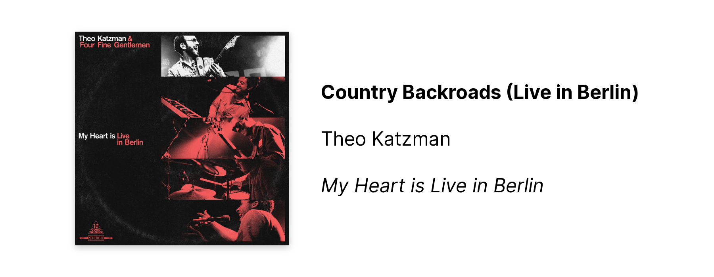
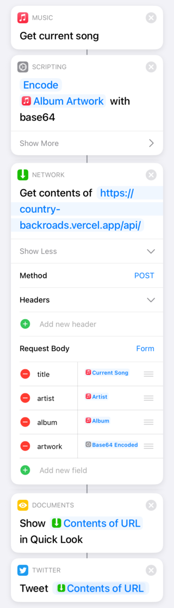

# country-backroads

Tweet the song you're currently listening to!

I like tweeting the music I listen to from time to time. Usually I do this by screenshotting the Apple Music player, but I've wanted a nicer way to do it for a while. So I made this function to generate a cover, which I can call from my phone with a shortcut.

Uses the [Inter font](https://github.com/rsms/inter), somewhat a slimmed down fork of [og-image](https://github.com/vercel/og-image).

## Setup

You can clone this project and deploy it to [Vercel](https://vercel.com/). From there you can use Apple Shortcuts to grab the song currently playing on your device, generate a cover, and tweet it.

Make sure to swap out the URL for your own Vercel deployment. (`https://country-backroads-*.vercel.app/api/`)

If you want to limit access, requests will be blocked if the `SECRET` environment variable is set in Vercel and incoming request lack the matching `Secret` header value.

